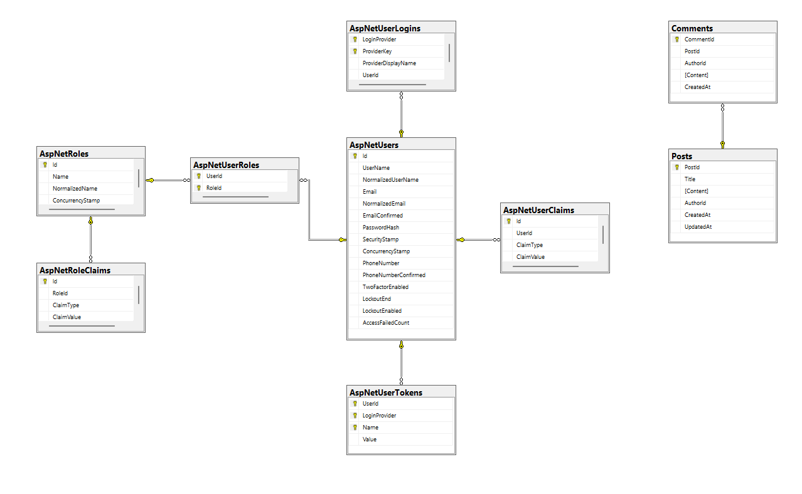
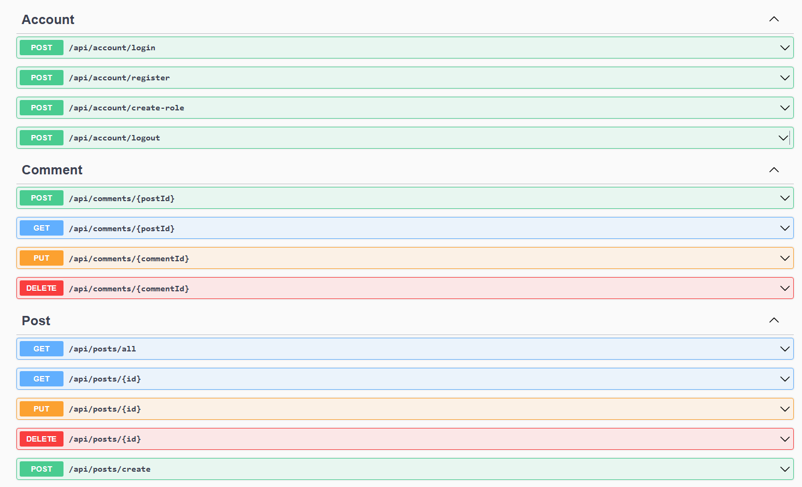
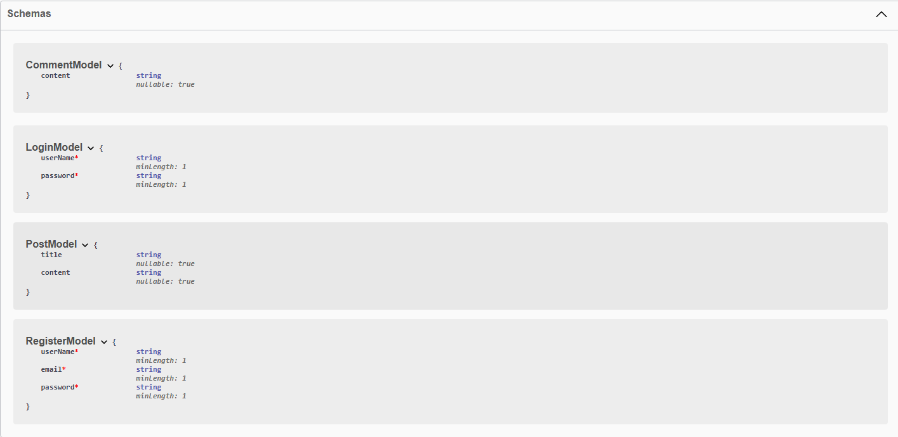

# Forum/Blog Project
Автор: Мрясов М.С
Тема: Форум/Блог

## About
Форум/блог - простой проект блога с возможностью регистрации пользователей,
создания постов, коментирования постов. 

особенности проекта, аутентификация и авторизация пользователей, разграничения доступа пользователем к части функционала по роли. Построен проект на бэкенде ASP.NET Rest Api и фронтенде Node.js React.

### Описание

**инфрастуктурная часть:**  
- Comment - класс сущности БД.  
- Post - класс сущности БД.  
- AppDbContext - класс контекста БД работающий сущностями.   

**Контроллеры и ДТО:**  
- PostController - контроллер управления постами.  
- CommentController - контроллер управления коментариями.  
- AccountController - контроллер управления аккаунтами.  
- PostModel - ДТО постов.  
- CommentModel - ДТО коментариев.  
- LoginModel - ДТО данных авторизации.  
- RegisterModel - ДТО данных регистрации.

**Страницы и компоненты:**  
- main.jsx и App.jsx - точка входа и основной компонент приложения.
- AuthContext.jsx - Контекст авторизации, сохраняющий `кред'ы` (авторизационные данные).
- CreatePost.jsx - страница создания поста.
- Home.jsx - домашняя страница.
- Register.jsx - страница регистрации.
- Login.jsx - страница авторизации.
- Post.jsx - страница поста.
- CommentList.jsx - компонент списка комментариев используется в Post.jsx.
- Header.jsx - компонент заголовка используется со всеми страницами.
- PostList.jsx - компонент списка постов используется в Home.jsx.

**Эндпоинты:**
- POST /api/account/login
- POST /api/account/register
- POST /api/create-role
---
- POST /api/comments/{postId}
- GET /api/comments/{postId}
- PUT /api/comments/{commentId}
- DELETE /api/comments/{commentId}
---
- GET /api/posts/all
- GET /api/posts/{id}
- PUT /api/posts/{id}
- DELETE /api/posts/{id}
- POST /api/posts/create

## Build & Run

Download
```cmd
git clone https://github.com/Plasmat1x/Term
cd ./Term
```

Backend
```cmd

cd ./Backend
dotnet build Backend.csproj
dotnet run Backend.csproj
```

Frontend
```cmd
cd ./Frontend
npm i
npm run dev
```

## Stack:
### Frontend:
- JS
- React
- Vite
- Tailwindcss
- Antd
- Reactrouter
- axios
 

### Backend:
- .NET 7
- ASP.NET Core
- Identity
- EntityFramework
- Swashbuckle

### Infrastructure:
- MSSQL 2016

## Media

ERD диаграмма БД.


диаграмма компонентов фронтенда.


диаграмма классов бэкенда.


Эндпоинты api


схема api

